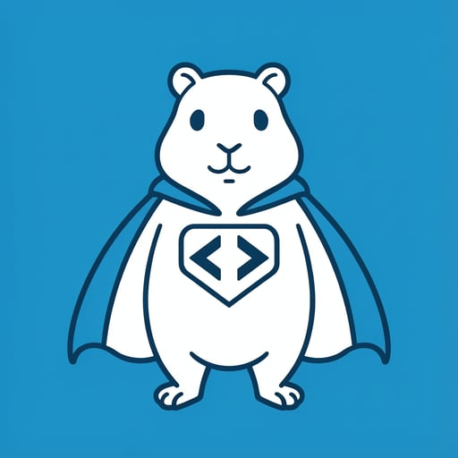

<div align="center">

# go-restkit

**Zero-dependency Go HTTP client for REST APIs with structured error handling.**

[](https://go.dev)
[](https://github.com/capcom6/go-restkit/actions)
[](https://codecov.io/gh/capcom6/go-restkit)
[](https://goreportcard.com/report/github.com/capcom6/go-restkit)
[](LICENSE)

<picture>
  <source media="(prefers-color-scheme: dark)" srcset="images/logo.png">
  
</picture>

<br />

[Explore the docs »](ERROR_HANDLING.md)
·
[Report Bug](https://github.com/capcom6/go-restkit/issues/new)
·
[Request Feature](https://github.com/capcom6/go-restkit/issues/new)

</div>

---

## Table of Contents

- [go-restkit](#go-restkit)
	- [Table of Contents](#table-of-contents)
	- [About](#about)
	- [Features](#features)
	- [Installation](#installation)
	- [Quick Start](#quick-start)
	- [Usage](#usage)
		- [Basic Requests](#basic-requests)
		- [Request Headers](#request-headers)
		- [Error Handling](#error-handling)
		- [Response Headers](#response-headers)
		- [Raw Requests](#raw-requests)
		- [Custom HTTP Client](#custom-http-client)
	- [API Reference](#api-reference)
		- [Config](#config)
		- [Client Methods](#client-methods)
		- [Error Types](#error-types)
		- [Helper Functions](#helper-functions)
		- [Sentinel Errors](#sentinel-errors)
	- [Development](#development)
	- [Roadmap](#roadmap)
	- [Contributing](#contributing)
	- [License](#license)
	- [Acknowledgments](#acknowledgments)

---

## About

`go-restkit` eliminates the boilerplate of making HTTP API calls in Go. It wraps `net/http` with automatic JSON marshaling/unmarshaling, a three-tier error classification system, and zero external dependencies.

Every HTTP client project ends up writing the same code: create a request, marshal JSON, set headers, read the response, check the status code, decode the body, handle errors. This library does all of that in a handful of methods, so you can focus on your API logic.

## Features

- **Zero external dependencies** — stdlib only
- **Automatic JSON** — marshal request bodies, decode responses
- **Three-tier errors** — classify failures as internal, infrastructure, or API errors
- **Structured error parsing** — access raw bodies and parse into custom types via `ErrorWithBody`
- **Header access** — response headers available on both success and error responses
- **Raw request support** — `DoRAW` / `DoRAWWithHeaders` for non-JSON payloads
- **Context support** — full `context.Context` propagation throughout
- **Custom client injection** — supply your own `http.Client` for timeouts, transports, etc.

## Installation

```bash
go get github.com/capcom6/go-restkit
```

Requires Go 1.24 or later.

## Quick Start

```go
package main

import (
	"context"
	"fmt"
	"log"

	rest "github.com/capcom6/go-restkit"
)

func main() {
	client, err := rest.NewClient(rest.Config{
		BaseURL: "https://api.example.com",
	})
	if err != nil {
		log.Fatal(err)
	}

	type User struct {
		ID    string `json:"id"`
		Name  string `json:"name"`
		Email string `json:"email"`
	}

	var user User
	if err := client.Do(context.Background(), "GET", "/users/1", nil, nil, &user); err != nil {
		log.Fatal(err)
	}

	fmt.Printf("User: %+v\n", user)
}
```

## Usage

### Basic Requests

```go
// POST with JSON payload and decode response
payload := map[string]string{"name": "John"}
var result map[string]any
if err := client.Do(ctx, "POST", "/users", nil, payload, &result); err != nil {
	// handle error
}
```

Passing `nil` as the response parameter skips JSON decoding. This is useful for endpoints that return no body or only headers:

```go
// DELETE that returns 204 No Content
if err := client.Do(ctx, "DELETE", "/users/1", nil, nil, nil); err != nil {
	// handle error
}
```

### Request Headers

```go
headers := http.Header{}
headers.Set("Authorization", "Bearer eyJhbGci...")
headers.Set("X-Idempotency-Key", "abc-123")

var result map[string]any
if err := client.Do(ctx, "GET", "/orders/42", headers, nil, &result); err != nil {
	// handle error
}
```

If no `Accept` header is set, it defaults to `application/json`. If the request has a body and no `Content-Type` is set, it defaults to `application/json`.

### Error Handling

`go-restkit` classifies errors into three tiers:

```go
err := client.Do(ctx, "GET", "/users/999", nil, nil, nil)

switch {
case rest.IsInternalError(err):
	// Request construction failure: JSON marshal, URL parse
	fmt.Println("Failed to build request:", err)

case rest.IsInfrastructureError(err):
	// Network failure: timeout, DNS, TLS
	fmt.Println("Network error:", err)

case rest.IsAPIError(err):
	// Server returned 4xx or 5xx
	if apiErr, ok := rest.AsAPIError(err); ok {
		var apiResp struct {
			Message string `json:"message"`
		}
		if parseErr := apiErr.ParseError(&apiResp); parseErr == nil {
			fmt.Printf("API error: %s\n", apiResp.Message)
		}
		fmt.Printf("Status: %d, URL: %s\n", apiErr.StatusCode, apiErr.URL)
	}
}
```

Use `IsClientError` / `IsServerError` to distinguish 4xx from 5xx:

```go
if rest.IsClientError(err) {
	// 400 Bad Request, 404 Not Found, 429 Too Many Requests, etc.
}
if rest.IsServerError(err) {
	// 500 Internal Server Error, 502 Bad Gateway, etc.
}
```

For complete documentation, see [ERROR_HANDLING.md](ERROR_HANDLING.md).

### Response Headers

Use `DoWithHeaders` or `DoRAWWithHeaders` when you need response headers:

```go
headers, err := client.DoWithHeaders(ctx, "GET", "/data", nil, nil, &result)
if err != nil {
	// headers are still available on API errors
	var apiErr *rest.APIError
	if errors.As(err, &apiErr) {
		retryAfter := apiErr.Headers.Get("Retry-After")
	}
}

requestID := headers.Get("X-Request-Id")
rateLimit := headers.Get("X-RateLimit-Remaining")
```

### Raw Requests

For non-JSON payloads, use `DoRAW`:

```go
payload := strings.NewReader("name=John&age=30")
var result map[string]any
if err := client.DoRAW(ctx, "POST", "/form", nil, payload, &result); err != nil {
	// handle error
}
```

### Custom HTTP Client

Inject a pre-configured `http.Client` for timeouts, custom transports, or TLS settings:

```go
httpClient := &http.Client{
	Timeout:   10 * time.Second,
	Transport: &http.Transport{
		MaxIdleConns:    100,
		IdleConnTimeout: 90 * time.Second,
	},
}

client, err := rest.NewClient(rest.Config{
	Client:  httpClient,
	BaseURL: "https://api.example.com",
})
```

## API Reference

### Config

| Field     | Type           | Description                                   |
| --------- | -------------- | --------------------------------------------- |
| `Client`  | `*http.Client` | Optional, defaults to `http.DefaultClient`    |
| `BaseURL` | `string`       | Optional base URL for request path resolution |

### Client Methods

| Method                                                            | Returns                | Description                     |
| ----------------------------------------------------------------- | ---------------------- | ------------------------------- |
| `Do(ctx, method, path, headers, payload, response)`               | `error`                | JSON request, no header return  |
| `DoWithHeaders(ctx, method, path, headers, payload, response)`    | `(http.Header, error)` | JSON request with header return |
| `DoRAW(ctx, method, path, headers, payload, response)`            | `error`                | Raw request, no header return   |
| `DoRAWWithHeaders(ctx, method, path, headers, payload, response)` | `(http.Header, error)` | Raw request with header return  |

### Error Types

| Type                  | Description                                                 |
| --------------------- | ----------------------------------------------------------- |
| `InternalError`       | Request construction failures (marshal, URL parse)          |
| `InfrastructureError` | Network-level failures (timeout, DNS, TLS)                  |
| `APIError`            | Server error responses with `StatusCode`, `Body`, `Headers` |

### Helper Functions

| Function                     | Purpose                              |
| ---------------------------- | ------------------------------------ |
| `AsAPIError(err)`            | Extract `*APIError` from error chain |
| `IsInternalError(err)`       | Check for internal errors            |
| `IsInfrastructureError(err)` | Check for network errors             |
| `IsAPIError(err)`            | Check for API errors                 |
| `IsClientError(err)`         | Check for 4xx responses              |
| `IsServerError(err)`         | Check for 5xx responses              |

### Sentinel Errors

| Error               | Meaning                         |
| ------------------- | ------------------------------- |
| `ErrInvalidConfig`  | Invalid client configuration    |
| `ErrEmptyMethod`    | Empty HTTP method provided      |
| `ErrEmptyErrorBody` | API error with empty body       |
| `ErrUnmarshalJSON`  | Failed to parse error body JSON |

## Development

```bash
make fmt       # Format with golangci-lint
make lint      # Run golangci-lint (strict config)
make test      # Run tests with race detector, shuffle, and coverage
make benchmark # Run benchmarks
make deps      # Download dependencies
```

CI runs lint and test on every push and pull request to `master`. Coverage is uploaded to Codecov.

## Roadmap

- [ ] Request/response interceptors (middleware chain)
- [ ] Streaming response support

Have a suggestion? Open an [issue](https://github.com/capcom6/go-restkit/issues/new).

## Contributing

Contributions are welcome! Here's how:

1. Fork the repository
2. Create a feature branch (`git checkout -b feature/my-feature`)
3. Commit your changes (`git commit -m 'Add my feature'`)
4. Push to the branch (`git push origin feature/my-feature`)
5. Open a Pull Request

Please ensure lint and tests pass before submitting.

## License

Distributed under the Apache 2.0 License. See [LICENSE](LICENSE) for more information.

## Acknowledgments

- [golangci-lint golden config](https://gist.github.com/maratori/47a4d00457a92aa426dbd48a18776322) by Marat Reymers
- [Best-README-Template](https://github.com/othneildrew/Best-README-Template) by Othneil Drew

---

<div align="center">
  <sub>Built with Go standard library — no dependencies, no fuss.</sub>
</div>
